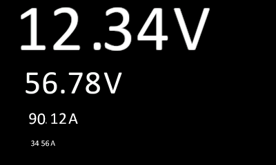
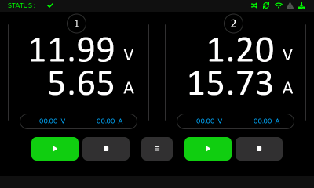

# Large Digit Display for LVGL (ESP32 / MicroPython)

This project enables displaying large digits using bitmap fonts with the [LVGL](https://lvgl.io/) graphics library, suitable for embedded devices like the ESP32 with a display (e.g., 5" Elecrow LCD). Following pistures show screenshot from example script large_digits.py (first one), and from real project of power source for laboratory (second one) used this LCD display.

 
 

## 📦 Project Contents

- `large_fonts.py` – Library for managing and rendering bitmap digits with zoom support.
- `large_digits.py` – Main application script that initializes the display, creates four digit displays, and shows sample values.
- `*.bmp` files – Bitmap images for each digit and symbol (`0`–`9`, `,`, `V`, `A`).


## ⚙️ Features and descriptions

- Display of four numeric values in the format `12.34 V` or `56.78 A`. (example)
- Each digit is rendered using a bitmap image instead of a standard font.
- Full zoom support: scale digits from 0% to undefined %.
- Decimal point and unit symbols are displayed using separate images.


  Micropython as a means of creating embedded system programs is becoming increasingly popular and gaining popularity. Often the limiting factor is the size of the operating memory or flash memory. Therefore, various images of the micropython system often have limited functionality by omitting some functions. Very often these are image and letter fonts that take up a lot of memory. Such a case is the image of micropython used for the popular esp32 series microcomputer in combination with the LVGL library.The described library helps solve this problem and the illustrative image shows a screen of a laboratory source using this library.

I based my research on the following criteria:
- minimum possible need for operating memory
- minimum possible consumption of program memory (flash or sd card)
- good ability to redraw the screen
- minimize flicker
- possibility of enlarging, reducing characters
- possibility of combining any fonts and symbols

Solution :

  I used a method where the displayed characters are images. Each character is a BMP image. The image must be 24 bit, otherwise the LVGL library cannot import it. I chose images of 50x96 points. whose size is around 10kB. With large displayed characters, the number of them on the screen that can be meaningfully placed is limited anyway, so in the function def _load_digit_images(self) I defined the characters and the corresponding bmp files that will be displayed somewhere on the screen. The number of loaded images can be changed arbitrarily. Each image is loaded into memory only once. But we need to display it x times in different places.  For this purpose, I used the lvgl.scr_load() function call, which creates an image object, but only using a reference to an already loaded BMP image, which significantly saves RAM. For each displayed position, I loaded images into the pool that could potentially be required for display at that position. Now, all I need to do is swap the images at that position. It's simple, but slow and the display refresh "flashes terribly". The solution is that all characters are loaded into a pile at that position and those that are not currently displayed are shifted to a position outside the display area, which is fast and efficient and can be done simply by calling the lvgl.img.set_offset_x() function. To optimize speed, only characters where a change is required are redrawn on the screen. This approach allows for fast changes (about 40 large image characters on the screen per second). Another advantage is the ability to enlarge or reduce the loops and thus achieve the display of any character size.

The disadvantage of this approach is that we are manipulating BMP images that have a fixed foreground and background color, so changing the background transparency or the color of the characters or background by changing the LVGL attributes is not possible.

## 🚀 Getting Started

1. Copy all `.py` files and `.bmp` images to your MicroPython device with LVGL support (e.g., ESP32-S3).
2. Run the main script:

```python
import large_digits
```

3. The screen will show four displays with different values and zoom levels.

## 🧠 Requirements

- [LVGL for MicroPython](https://github.com/lvgl/lv_binding_micropython)
- A compatible display (e.g., Elecrow 5" DIS07050H) - tested
- MicroPython build with support for `lvgl`, `framebuf`, `os`, `gc`

## 🖼️ BMP Image Format

- 24-bit BMP format
- RGB converted to RGB565 for display compatibility
- Digit size and design can be customized using image editors (e.g., GIMP)

## 🛠️ Customization

- Spacing, units, and zoom can be adjusted via parameters in the `DigitDisplay` class.
- Additional characters can be added by extending the `digit_files` dictionary in `large_fonts.py` and providing matching `.bmp` images.
- easy way for adopt to another type of displays modifying display.py library containing display drivers, touch screen and LVGL initialization.

## 🧪 Example Output Values

| Position       | Value | Unit | Zoom  |
|----------------|-------|------|-------|
| Top Left       | 12.34 | V    | 200%  |
| Top Right      | 56.78 | V    | 100%  |
| Bottom Left    | 90.12 | A    | 50%   |
| Bottom Right   | 34.56 | A    | 25%   |

## 📄 Libraray documentation

- description of classes, functions, attributes is decribed in [large_fonts_doc.md](large_fonts_doc.md) file.

## 📄 Disclaimers and license

This project is open-source. You may use and modify it freely. Provide your own bitmap images for custom fonts or symbols. You may use the program as is at your own risk, no updates or modifications to the code will be made, no planed, and no warranties or claims for damages will be made in connection with any use of this code.
